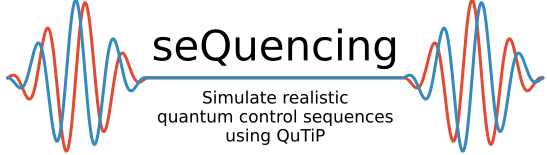

# seQuencing



``sequencing`` is a Python package for simulating realistic quantum control sequences using [QuTiP](http://qutip.org/docs/latest/index.html). Built for researchers and quantum engineers, ``sequencing`` provides an intuitive framework for constructing models of quantum systems
composed of many modes and generating complex time-dependent control Hamiltonians
for [master equation simulations](http://qutip.org/docs/latest/guide/dynamics/dynamics-master.html).

### Requirements:

- `python>=3.7` (``sequencing`` is tested on 3.7, 3.8, and 3.9)
- [`qutip>=4.5`](http://qutip.org/docs/latest/installation.html)
- [`attrs>=20`](https://www.attrs.org/en/stable/index.html)
- [`tqdm`](https://tqdm.github.io/)
- [`lmfit`](https://lmfit.github.io/lmfit-py/)

### Installing from source:

- Clone the `sequencing` repo
- Create a conda environment
  - `conda create -n <env-name> python=<3.7, 3.8, or 3.9>`
- Activate the conda environment
  - `conda activate <env-name>`
- Install `sequencing`
  - `pip install -e .`, or 
  - `python setup.py develop` (or `install`)


**Important note for Windows users:**

>[QuTip: Installation on MS Windows:](http://qutip.org/docs/latest/installation.html#installation-on-ms-windows) As of QuTiP 4.1, recommended installation on Windows requires Python 3.5+, as well as Visual Studio 2015... When installing Visual Studio 2015 be sure to select options for the C++ compiler... The ‘Community’ edition of Visual Studio 2015 is free...

### Getting started:

Check out the tutorial notebooks [here](docs/source/notebooks)

### Unit tests:

Run all of the unit tests from a Python session using

``` python
>>> import sequencing.testing as st
>>> st.run()
```

Or run them from the command line, using

```
pytest --cov
```

### Contributing:
Want to contribute to `sequencing`? Check out our [contribution guidelines](CONTRIBUTING.md).


### Making the docs:

Make an HTML version of the documentation.

> **Note**: This might require installing [Pandoc](https://pandoc.org/installing.html).

```
pip install sphinx sphinx_rtd_theme nbsphinx
cd docs
make html
```
